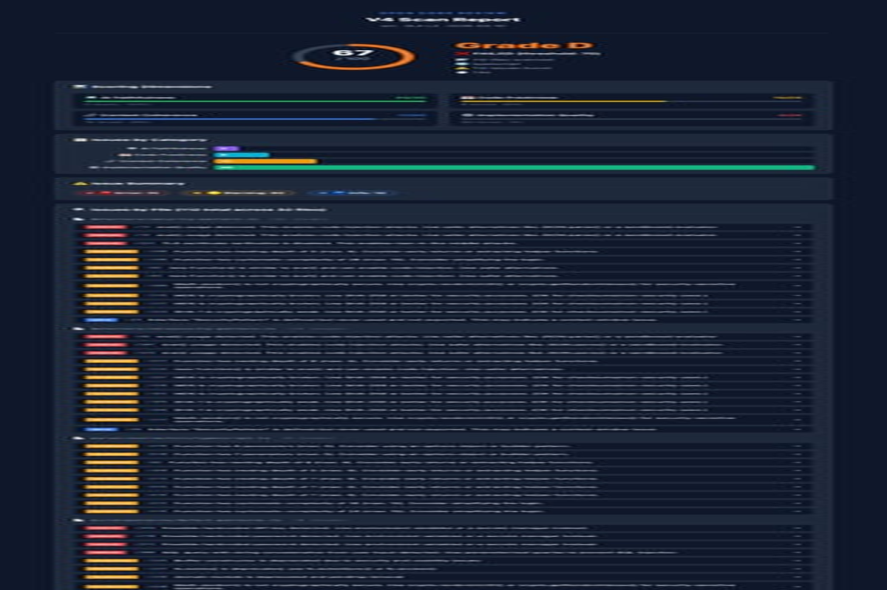

# Open Code Review

> The first CI/CD quality gate built for AI-generated code.
> Free. Self-hostable. Not another linter.

[](https://www.npmjs.com/package/@opencodereview/cli)
[](LICENSE)
[](https://github.com/raye-deng/open-code-review/actions/workflows/ci.yml)

## Why?

AI coding assistants (Copilot, Cursor, Claude) generate code with **defects that traditional tools miss entirely**:

| Defect | Example | ESLint / SonarQube |
|--------|---------|-------------------|
| **Hallucinated imports** | `import { x } from 'non-existent-pkg'` | ❌ Miss |
| **Stale APIs** | Using deprecated APIs from training data | ❌ Miss |
| **Context window artifacts** | Logic contradictions across files | ❌ Miss |
| **Over-engineered patterns** | Unnecessary abstractions, dead code | ❌ Miss |
| **Security anti-patterns** | Hardcoded example secrets, `eval()` | ⚠️ Partial |

Open Code Review detects all of them — in **under 10 seconds**, for **free**, running **100% locally**.

## Demo

### Terminal Output (L2 Self-Scan)

OCR scans itself. Here's what it found:

```
╔══════════════════════════════════════════════════════════════╗
║           Open Code Review V4 — Quality Report              ║
╚══════════════════════════════════════════════════════════════╝

  Project: packages/core/src
  SLA: L2 Standard — Structural + Embedding + Local AI

  📊 112 issues found in 110 files

  Overall Score: 67/100  🟠 D
  Threshold: 70  |  Status: ❌ FAILED
  Files Scanned: 110  |  Languages: typescript  |  Duration: 8.7s

  ── Scoring Dimensions ──

  AI Faithfulness           ████████████████████ 35/35 (100%)
  Code Freshness            ████████████░░░░░░░░ 15/25 (60%)
  Context Coherence         █████████████████░░░ 17/20 (85%)
  Implementation Quality    ░░░░░░░░░░░░░░░░░░░░ 0/20 (0%)

  ── Sample Findings ──

  🔴 [error] defect-patterns.ts:269 — Possible hardcoded API key detected
  🔴 [error] defect-patterns.ts:308 — SQL injection via string concatenation
  🔴 [error] security-pattern.ts:73  — eval() enables code injection attacks
  🔴 [error] security-pattern.ts:151 — TLS certificate verification disabled
  🟡 [warn]  stale-api.ts:51        — url.parse() deprecated → WHATWG URL API
  🟡 [warn]  over-engineering.ts:37  — Cyclomatic complexity 28 (max: 15)
  🟡 [warn]  hallucination.ts:58    — Nesting depth 9 (max: 4)
  ⚪ [info]  pipeline.ts:36         — Unused interface (context window artifact)
```

Also available as HTML: `ocr scan src/ --format html -o report.html`

### 📊 L2 HTML Report Sample



**Features of HTML Report:**
- Interactive issue browser with severity filters
- Detailed code snippets with context
- Scoring breakdown by dimension
- Export to JSON/SARIF

📄 [View full HTML report](docs/demo-reports/v4-l2/self-scan.html)

## How It Compares

| | Open Code Review | Claude Code Review | CodeRabbit | GitHub Copilot |
|---|---|---|---|---|
| **Price** | **Free** | $15–25/PR | $24/mo/seat | $10–39/mo |
| **Open Source** | ✅ | ❌ | ❌ | ❌ |
| **Self-hosted** | ✅ | ❌ | Enterprise | ❌ |
| **AI Hallucination Detection** | ✅ | ❌ | ❌ | ❌ |
| **Stale API Detection** | ✅ Specialized | General | ❌ | ❌ |
| **Local AI (Ollama)** | ✅ | ❌ | ❌ | ❌ |
| **Registry Verification** | ✅ npm/PyPI | ❌ | ❌ | ❌ |
| **SARIF Output** | ✅ | ❌ | ❌ | ❌ |
| **GitHub + GitLab** | ✅ Both | GitHub only | Both | GitHub only |
| **Review Speed** | <10s (L1) | ~20 min | ~30s | ~30s |
| **Data Privacy** | ✅ 100% local | ❌ Cloud | ❌ Cloud | ❌ Cloud |

## Quick Start

```bash
# Install
npm install -g @opencodereview/cli

# Scan your project (L1 — fast, no AI needed)
ocr scan src/ --sla L1

# Scan with AI analysis (L2 — requires Ollama or OpenAI)
ocr scan src/ --sla L2
```

## Two-Stage Pipeline (L1 + L2)

```
L1: Pattern Detection (fast, local, free)
├── Hallucinated import detection (npm/PyPI registry check)
├── Deprecated API detection (AST-based)
├── Security anti-pattern matching
├── Over-engineering heuristics
├── Code duplication analysis
└── Score: 0-100 with letter grade

L2: AI Deep Analysis (Embedding + LLM)
├── Embedding recall → risk scoring → Top-N suspicious blocks
├── LLM analysis (Ollama local or OpenAI/Anthropic cloud)
├── Cross-file context coherence
├── Semantic duplication detection
└── Enhanced scoring with AI confidence
```

## CI/CD Integration

### GitHub Action

```yaml
- uses: raye-deng/open-code-review@v1
  with:
    sla: L1
    threshold: 60
    scan-mode: diff
    github-token: ${{ secrets.GITHUB_TOKEN }}
```

### GitLab CI

```yaml
code-review:
  script:
    - npx @opencodereview/cli scan src/ --sla L1 --threshold 60 --format json --output ocr-report.json
  artifacts:
    reports:
      codequality: ocr-report.json
```

### CLI

```bash
ocr scan src/ --sla L1 --format terminal    # Pretty output
ocr scan src/ --sla L1 --format json        # JSON for CI
ocr scan src/ --sla L1 --format sarif       # SARIF for GitHub
ocr scan src/ --sla L1 --format html        # HTML report
```

## L2 Configuration (Ollama)

```yaml
# .ocrrc.yml
sla: L2
ai:
  embedding:
    provider: ollama
    model: nomic-embed-text
    baseUrl: http://localhost:11434
  llm:
    provider: ollama
    model: qwen3-coder
    endpoint: http://localhost:11434
```

## Project Structure

```
packages/
  core/              # Detection engine + scoring (@opencodereview/core)
  cli/               # CLI tool — ocr command (@opencodereview/cli)
  github-action/     # GitHub Action wrapper
```

## Supported Languages

TypeScript, JavaScript, Python, Go, Java, Kotlin (more coming)

## License

[BSL-1.1](LICENSE) — Free for personal and non-commercial use.
Converts to Apache 2.0 on 2030-03-11.
Commercial use requires a [Team or Enterprise license](https://codes.evallab.ai/pricing).
