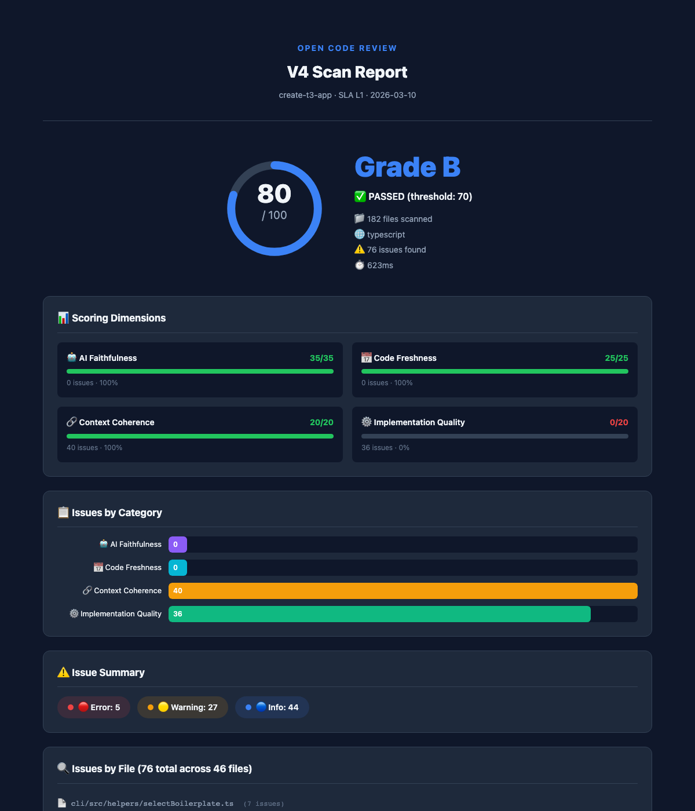
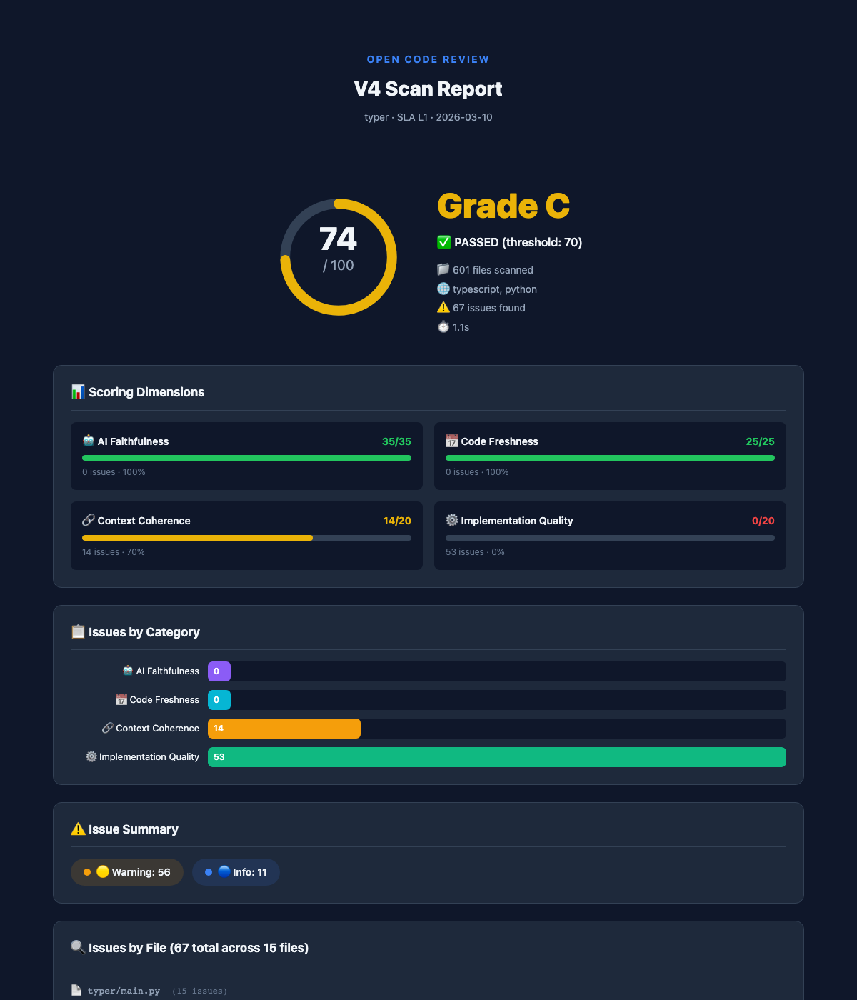
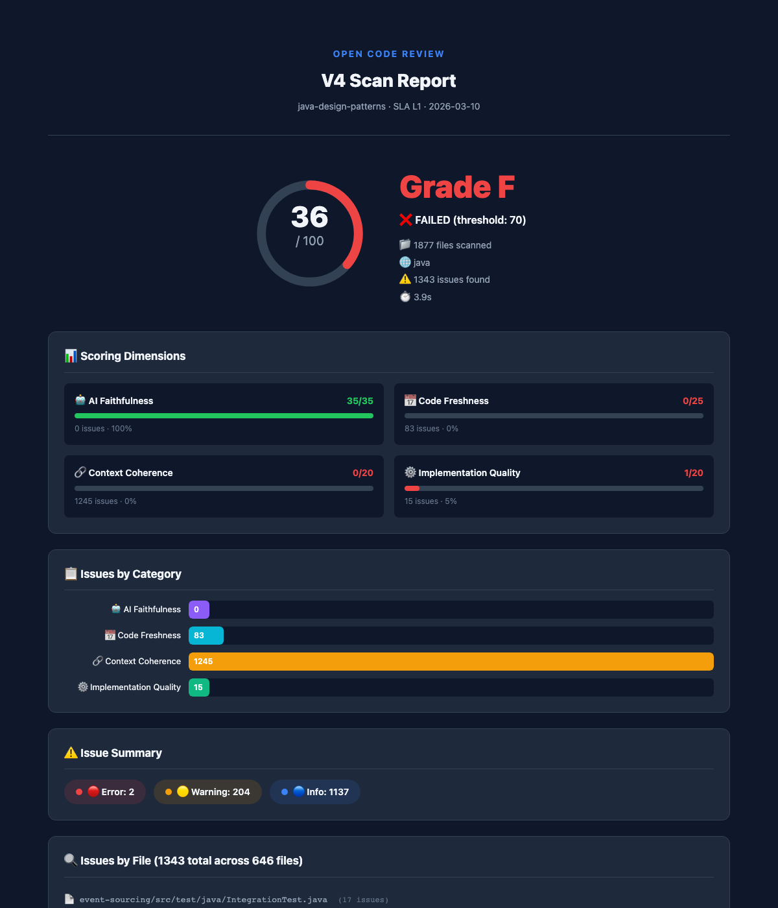
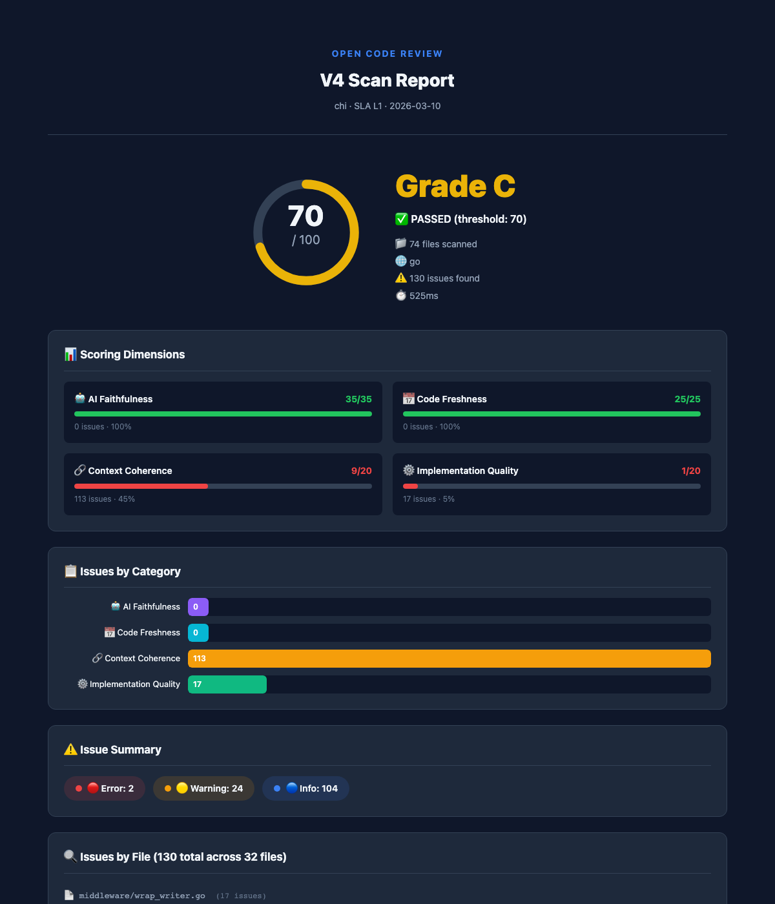
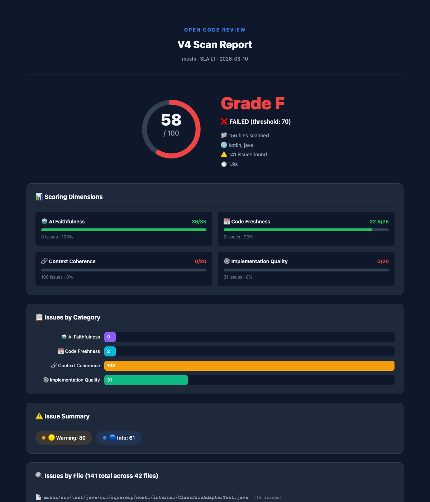

# Open Code Review (OCR)

> The first open-source CI/CD quality gate built specifically for AI-generated code.  
> Free forever. Self-hostable. Not another linter.

[](https://www.npmjs.com/package/open-code-review)
[](LICENSE)

> **Free for personal use. Commercial use requires a Team or Enterprise license.**

## Why Open Code Review?

AI coding assistants (Copilot, Cursor, Claude, ChatGPT) generate code with **unique defects** that traditional tools miss:

- 🔴 **Hallucinated packages** — `import { x } from 'non-existent-pkg'`
- 🟠 **Stale APIs from training data** — using deprecated APIs the model "remembers"
- 🟡 **Context window artifacts** — logic contradictions when the model loses context
- 🟡 **Over-engineered abstractions** — AI loves unnecessary design patterns
- 🔵 **Security anti-patterns** — hardcoded example secrets left in production code

**ESLint, SonarQube, and CodeRabbit won't catch these.** They're designed for human-written code.

## How It Works

Two-stage AI pipeline:

```
Stage 1: Embedding Recall (fast, cheap)
  Code blocks → Embedding model → Risk scoring → Top-N suspicious blocks

Stage 2: LLM Deep Scan (precise)
  Suspicious blocks → LLM analysis → Confirmed issues + fix suggestions
```

## vs The Competition

| | Claude Code Review | CodeRabbit | GitHub Copilot Review | **Open Code Review** |
|---|---|---|---|---|
| **Price** | $15-25/PR | $24/mo/seat | $10-39/mo | **Free** |
| **Open Source** | ❌ | ❌ | ❌ | **✅ BSL-1.1** |
| **Self-hosted** | ❌ | ❌ | ❌ | **✅** |
| **AI Hallucination Detection** | ❌ | ❌ | ❌ | **✅** |
| **Dynamic Registry Verification** | ❌ | ❌ | ❌ | **✅** |
| **Local AI (Ollama)** | ❌ | ❌ | ❌ | **✅** |
| **SARIF Output** | ❌ | ❌ | ❌ | **✅** |
| **GitLab + GitHub + Any CI** | GitHub only | GitHub/GitLab | GitHub only | **✅ All** |
| **Focus** | General review | General review | General review | **AI-code defects** |

> We don't replace your code reviewer. We catch what it can't see.

## Real-World Scan Results

Scanned 5 popular open-source repositories across 5 languages with V4 (L1 structural analysis):

### create-t3-app (TypeScript) — Score: 80 / Grade B


### typer (Python) — Score: 74 / Grade C


### java-design-patterns (Java) — Score: 36 / Grade F


### chi (Go) — Score: 70 / Grade C


### moshi (Kotlin) — Score: 58 / Grade F


> **These are well-maintained, human-written projects.** AI-generated code typically scores lower.  
> V4 reduced per-file false positives by **88%** compared to V3. See [full comparison →](docs/demo-reports/v4/SUMMARY.md)

## Quick Start

```bash
npx open-code-review scan .

# or with short alias
npx ocr scan .
```

## Supported Languages

| Language | Parser | Registry |
|----------|--------|----------|
| TypeScript / JavaScript | tree-sitter | npm registry |
| Python | tree-sitter | PyPI |
| Java | tree-sitter | Maven Central |
| Go | tree-sitter | Go Proxy |
| Kotlin | tree-sitter | Maven Central |

## SLA Service Levels

| Level | Speed | AI | Best For |
|-------|-------|----|----------|
| **L1 Fast** | ≤10s/100 files | Embedding only | PR checks, CI gates |
| **L2 Standard** | ≤30s/100 files | + Local AI (Ollama) | Daily scans |
| **L3 Deep** | ≤120s/100 files | + Remote AI (OpenAI/Claude) | Release audits |

## Scoring

4 dimensions focused on AI-specific quality:

| Dimension | Weight | What It Measures |
|-----------|--------|-----------------|
| AI Faithfulness | 35% | Do imports/APIs actually exist? |
| Code Freshness | 25% | Are APIs current, not deprecated? |
| Context Coherence | 20% | Is logic consistent across the file? |
| Implementation Quality | 20% | Complete? Error handling? Over-engineered? |

Grades: **A+** (95-100) → **F** (0-59)

## CI Integration

### GitHub Action
```yaml
- uses: raye-deng/open-code-review@v3
  with:
    license: ${{ secrets.OCR_LICENSE }}
```

### GitLab CI
```yaml
include:
  - remote: 'https://codes.evallab.ai/ci/gitlab-component.yml'
```

## Configuration

```yaml
# .ocrrc.yml
scan:
  languages: [typescript, python, java, go, kotlin]
  sla: L2
registry:
  npm: { url: 'https://registry.npmjs.org' }
  pypi: { url: 'https://pypi.org' }
  maven: { url: 'https://repo1.maven.org/maven2' }
  # Enterprise? Point to your internal registry:
  # npm: { url: 'https://nexus.internal.com/repository/npm/', token: '...' }
ai:
  local: { provider: ollama, model: codellama:13b }
  remote: { provider: openai, model: gpt-4o-mini }
  strategy: local-first
```

## Philosophy

- **Don't reinvent the wheel.** ESLint handles formatting. SonarQube handles complexity. We handle what AI breaks.
- **Open by default.** BSL-1.1 license (free for personal use, Apache 2.0 after 4 years), no vendor lock-in, runs on your hardware.
- **AI understands AI.** We use embeddings + LLM to detect issues only AI would create.

## License

[Business Source License 1.1](LICENSE) — free for personal and non-commercial use. Commercial use requires a [Team or Enterprise license](https://codes.evallab.ai/pricing). Code becomes Apache 2.0 on 2030-03-11.
