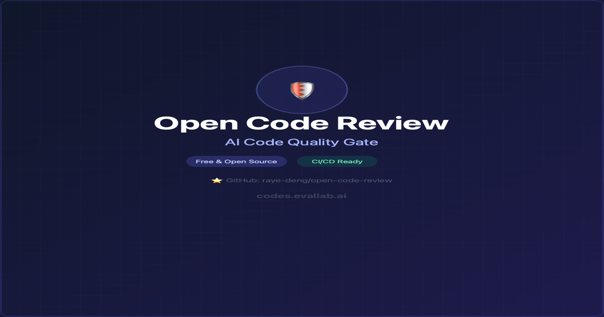

# Open Code Review

> **The first open-source CI/CD quality gate built specifically for AI-generated code.**
> Detects hallucinated imports, stale APIs, over-engineering, and security anti-patterns — powered by local LLMs and any OpenAI-compatible provider.
> Free. Self-hostable. 6 languages.



[](https://www.npmjs.com/package/@opencodereview/cli)
[](https://www.npmjs.com/package/@opencodereview/cli)
[](LICENSE)
[](https://github.com/raye-deng/open-code-review/actions/workflows/ci.yml)
[](https://github.com/raye-deng/open-code-review)
[](http://makeapullrequest.com)

## Works With


> Any AI tool that generates code — if it writes it, OCR reviews it.

## What AI Linters Miss

AI coding assistants (Copilot, Cursor, Claude) generate code with **defects that traditional tools miss entirely**:

| Defect | Example | ESLint / SonarQube |
|--------|---------|-------------------|
| **Hallucinated imports** | `import { x } from 'non-existent-pkg'` | ❌ Miss |
| **Stale APIs** | Using deprecated APIs from training data | ❌ Miss |
| **Context window artifacts** | Logic contradictions across files | ❌ Miss |
| **Over-engineered patterns** | Unnecessary abstractions, dead code | ❌ Miss |
| **Security anti-patterns** | Hardcoded example secrets, `eval()` | ❌ Partial |

Open Code Review detects all of them — across **6 languages**, for **free**.

## Demo


📄 [View full interactive HTML report](docs/demo-reports/v4-l2/self-scan.html)

### Quick Preview

```bash
$ ocr scan src/ --sla L3

╔══════════════════════════════════════════════════════════════╗
║           Open Code Review — Deep Scan Report               ║
╚══════════════════════════════════════════════════════════════╝

  Project: packages/core/src
  SLA: L3 Deep — Structural + Embedding + LLM Analysis

  112 issues found in 110 files

  Overall Score: 67/100  D
  Threshold: 70  |  Status: FAILED
  Files Scanned: 110  |  Languages: typescript  |  Duration: 12.3s
```

## Deep Scan (L3) — How It Works

L3 combines three analysis layers for maximum coverage:

```
Layer 1: Structural Detection         Layer 2: Semantic Analysis        Layer 3: LLM Deep Scan
├── Hallucinated imports (npm/PyPI)   ├── Embedding similarity recall   ├── Cross-file coherence check
├── Stale API detection               ├── Risk scoring                  ├── Logic bug detection
├── Security patterns                 ├── Context window artifacts      ├── Confidence scoring
├── Over-engineering metrics          └── Enhanced severity ranking     └── AI-powered fix suggestions
└── A+ → F quality scoring
```

**Powered by local LLMs or any OpenAI-compatible API.** Run Ollama for 100% local analysis, or connect to any remote LLM provider — the interface is the same.

```bash
# Local analysis (Ollama)
ocr scan src/ --sla L3 --provider ollama --model qwen3-coder

# Any OpenAI-compatible provider
ocr scan src/ --sla L3 --provider openai-compatible \
  --api-base https://your-llm-endpoint/v1 --model your-model --api-key YOUR_KEY
```

## AI Auto-Fix — `ocr heal`

Let AI automatically fix the issues it finds. Review changes before applying.

```bash
# Preview fixes without changing files
ocr heal src/ --dry-run

# Apply fixes + generate IDE rules
ocr heal src/ --provider ollama --model qwen3-coder --setup-ide

# Only generate IDE rules (Cursor, Copilot, Augment)
ocr setup src/
```

## Multi-Language Detection

Language-specific detectors for **6 languages**, plus hallucinated package databases (npm, PyPI, Maven, Go modules):

| Language | Specific Detectors |
|----------|-------------------|
| **TypeScript / JavaScript** | Hallucinated imports (npm), stale APIs, over-engineering |
| **Python** | Bare `except`, `eval()`, mutable default args, hallucinated imports (PyPI) |
| **Java** | `System.out.println` leaks, deprecated `Date/Calendar`, hallucinated imports (Maven) |
| **Go** | Unhandled errors, deprecated `ioutil`, `panic` in library code |
| **Kotlin** | `!!` abuse, `println` leaks, null-safety anti-patterns |

## How It Compares

| | Open Code Review | Claude Code Review | CodeRabbit | GitHub Copilot |
|---|---|---|---|---|
| **Price** | **Free** | $15–25/PR | $24/mo/seat | $10–39/mo |
| **Open Source** | ✅ | ❌ | ❌ | ❌ |
| **Self-hosted** | ✅ | ❌ | Enterprise | ❌ |
| **AI Hallucination Detection** | ✅ | ❌ | ❌ | ❌ |
| **Stale API Detection** | ✅ | ❌ | ❌ | ❌ |
| **Deep LLM Analysis** | ✅ | ❌ | ❌ | ❌ |
| **AI Auto-Fix** | ✅ | ❌ | ❌ | ❌ |
| **Multi-Language** | ✅ 6 langs | ❌ | JS/TS | JS/TS |
| **Registry Verification** | ✅ npm/PyPI/Maven | ❌ | ❌ | ❌ |
| **SARIF Output** | ✅ | ❌ | ❌ | ❌ |
| **GitHub + GitLab** | ✅ Both | GitHub only | Both | GitHub only |
| **Data Privacy** | ✅ 100% local | ❌ Cloud | ❌ Cloud | ❌ Cloud |

## Quick Start

```bash
# Install
npm install -g @opencodereview/cli

# Fast scan — no AI needed
ocr scan src/

# Deep scan — with local LLM (Ollama)
ocr scan src/ --sla L3 --provider ollama --model qwen3-coder

# Deep scan — with any OpenAI-compatible provider
ocr scan src/ --sla L3 --provider openai-compatible \
  --api-base https://your-provider/v1 --model your-model --api-key YOUR_KEY
```

## CI/CD Integration

### GitHub Actions (30 seconds)

```yaml
name: Code Review
on: [pull_request]

jobs:
  review:
    runs-on: ubuntu-latest
    steps:
      - uses: actions/checkout@v4
      - uses: raye-deng/open-code-review@v1
        with:
          sla: L1
          threshold: 60
          github-token: ${{ secrets.GITHUB_TOKEN }}
```

### GitLab CI

```yaml
code-review:
  script:
    - npx @opencodereview/cli scan src/ --sla L1 --threshold 60 --format json --output ocr-report.json
  artifacts:
    reports:
      codequality: ocr-report.json
```

### Output Formats

```bash
ocr scan src/ --format terminal    # Pretty terminal output
ocr scan src/ --format json        # JSON for CI pipelines
ocr scan src/ --format sarif       # SARIF for GitHub Code Scanning
ocr scan src/ --format html        # Interactive HTML report
```

### Configuration

```yaml
# .ocrrc.yml
sla: L3
ai:
  embedding:
    provider: ollama
    model: nomic-embed-text
    baseUrl: http://localhost:11434
  llm:
    provider: ollama
    model: qwen3-coder
    endpoint: http://localhost:11434

  # Or use any OpenAI-compatible provider:
  # provider: openai-compatible
  # apiBase: https://your-llm-endpoint/v1
  # model: your-model
```

## Project Structure

```
packages/
  core/              # Detection engine + scoring (@opencodereview/core)
  cli/               # CLI tool — ocr command (@opencodereview/cli)
  github-action/     # GitHub Action wrapper
```

## Who Is This For?

- **Teams using AI coding assistants** — Copilot, Cursor, Claude Code, Codex, or any LLM-based tool that generates production code
- **Open-source maintainers** — Review AI-generated PRs for hallucinated imports, stale APIs, and security anti-patterns before merging
- **DevOps / Platform engineers** — Add a quality gate to CI/CD pipelines without sending code to cloud services
- **Security-conscious teams** — Run everything locally (Ollama), keep your code on your machines
- **Solo developers** — Free, fast, and works with zero configuration (`npx @opencodereview/cli scan src/`)

## License

[BSL-1.1](LICENSE) — Free for personal and non-commercial use. Converts to Apache 2.0 on 2030-03-11.
Commercial use requires a [Team or Enterprise license](https://codes.evallab.ai/pricing).

---

**Star this repo if you find it useful — it helps more than you think!**
